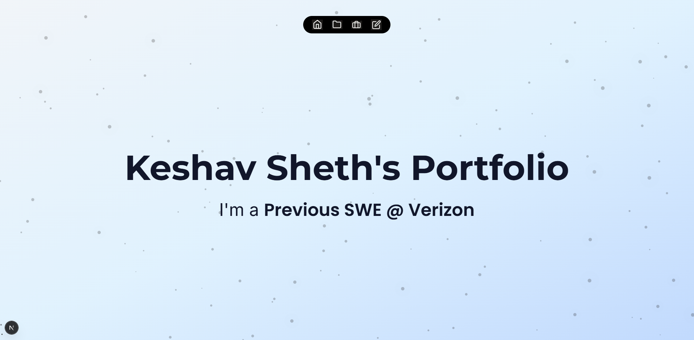
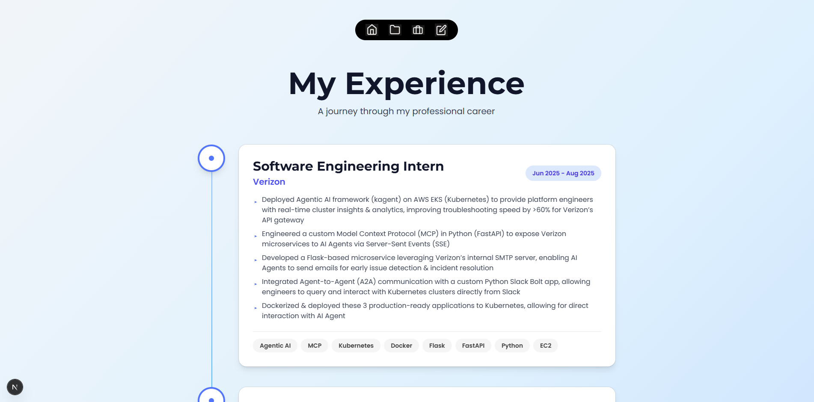
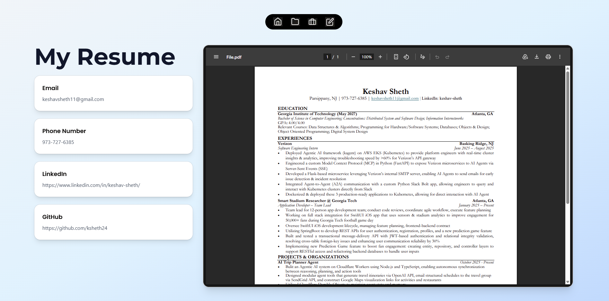

# Personal Portfolio

An interactive portfolio showcasing projects, experience, and skills with responsive, animated project cards, searchable/filterable views, and detailed modal previews. Focused on clarity and accessibility, it delivers fast navigation, and convenient contact/resume access

## Deployment

This project was deployed using Vercel. This can be accessed at: https://www.keshavsheth.com/

## Key Features

- **Sleek Home Screen** 
Hero section with a short introduction, rotating highlight text, and quick links to projects and resume; sets the visual tone and primary call-to-action. Emphasis on ease of navigation between pages. 

- **Projects Overview** 
Grid of interactive project cards with short summaries and affordances to open detailed views. Each project overview is accompanied with details on technologies used.

- **Project Details** Expanded project presentation that users can navigate to from the projects page with key features, screenshots, and links (demo / repo); used for in-depth context without leaving the projects list.

- **Experience Page** Chronological timeline or list of roles and accomplishments with company/project highlights and concise impact statements.

- **Resume/Contact Page** Printable / downloadable resume view plus a concise summary of skills and certifications; includes a clear download or open-resume action.

